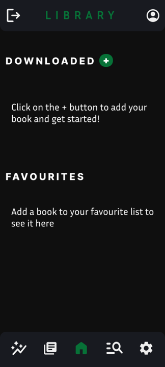
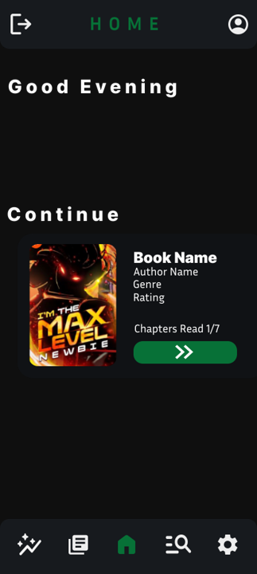
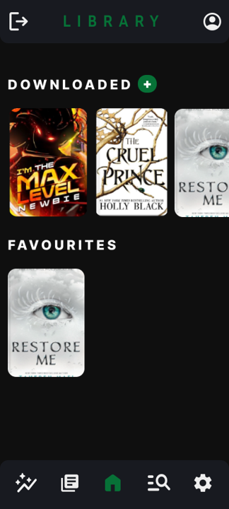
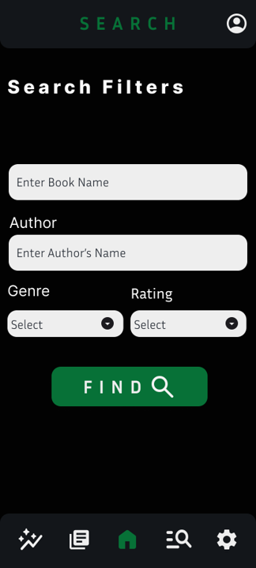
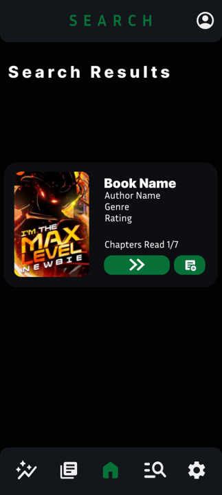
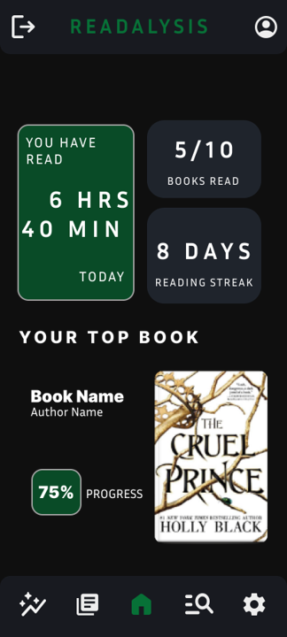

# ANNOTO- ALL IN ONE EBOOK READER AND TRACKER
A simple, no fuss implementation of an EBook reading interface- but not just limited to reading EBooks.

## ℹ️ You can: 
 - Track your reading analytics, including how long you read- monthly, daily, or annualy.
 - Highlight text with colors, so you not miss any of those catchphrases.
 - Access your reading material and analytics from any device using your account.

## ⚙️ Tech Stack:
- Flutter- For App Framework.
- Firebase- For user account management and realtime database storage of user's reading data.
- Misc- Custom Javascript Injected implementation for highlighting text in EBook reader feature.

## 📱 Screenshots:

## ✅ Current Project Status: MVP (basic EBook reading implementation is done)

### 🛠️ The app is single handedly being developed and maintained by me, and has not yet been developed with all the target features.
#### More documentation and updates coming soon :)

